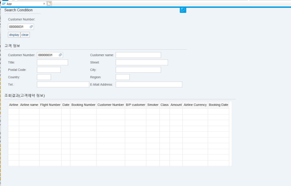
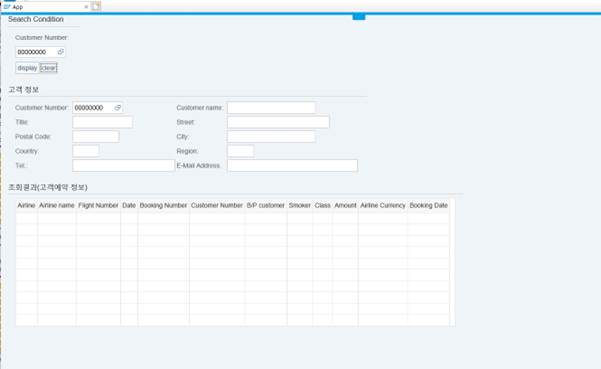
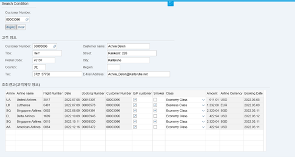

# Introduction
If you enter a customer ID and press the DISPLAY button, the information is brought up according to the set frame, and if you press the CLEAR button, it is deleted.  

## images
* Default page
 
* If you press clear button
 
* If you press display button
  
